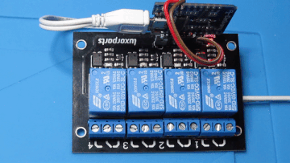
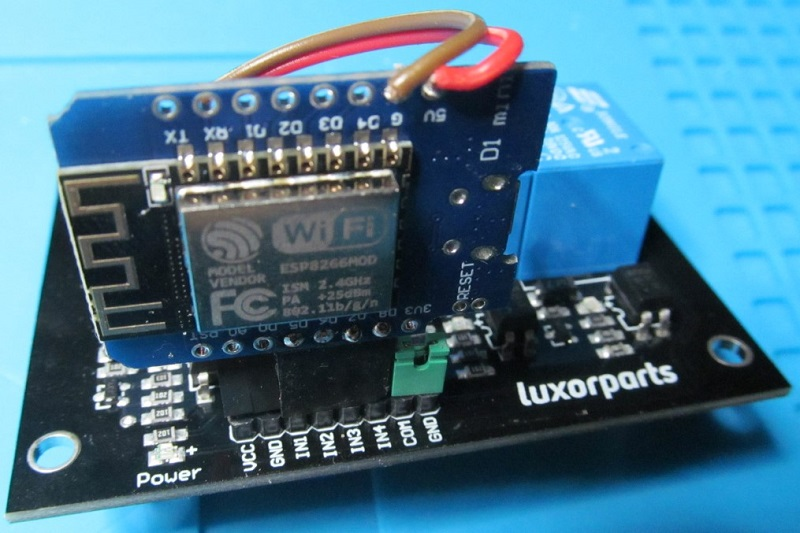
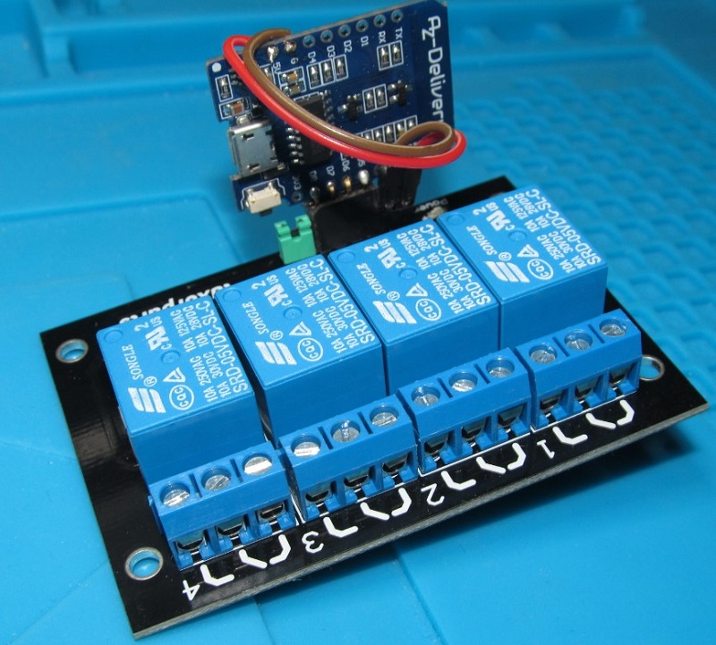
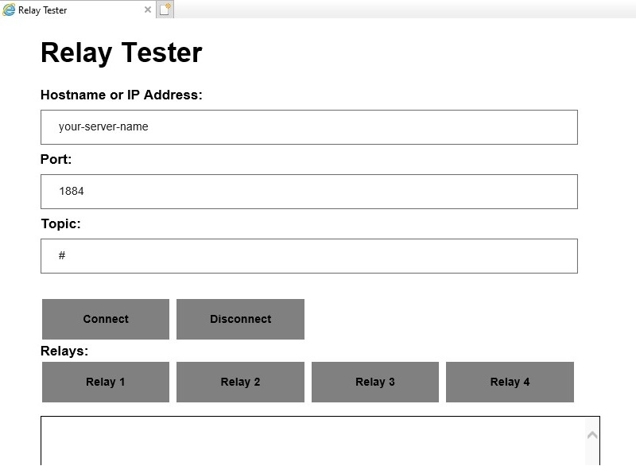
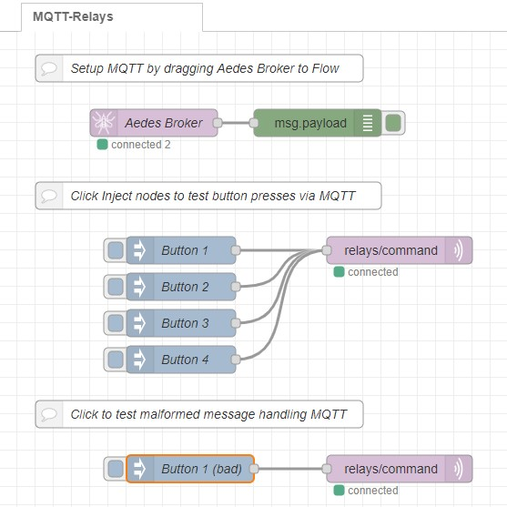
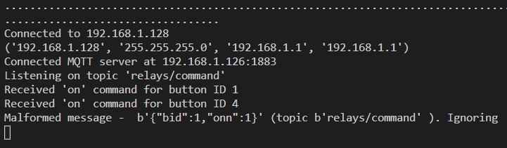

# MQTT Relay Station

A station which communicates 4 relay on off status and configures switch behavior based on command messages, via Wifi.

At this point in time, our relay functionality requires a pulse to be sent, which keeps the relay switched on for a given amount of time, then automatically switched off again. We call this feature 'pulse'. More functions can come later, when needed.



This Micropython code can be used as a template for decoupling hardware features from a more complex environment, via MQTT.

This code is licensed under GNU GPL 3.

## Installation

* clone repo
* copy **config.py.example** to **config.py** (which is excluded in .gitignore) and edit **config.py** with your environment parameters
* deploy to a micropython compatible esp8266 device

## Requirements

This device is completely straightforward to obtain and build. It's of course built as a part of a possibly more complex environment of things.

For hardware, you simply need the following:

* Any ESP8266 board. A cheap one will do (we used an Wemos D2 Mini clone)
* A relay board
* Appropriate header for your assembly

From software point of view:

* Micropython flashed on your ESP8266 device and a functional development environment
* An MQTT server to relay the On/Off commands. Our configuration is all managed by a Raspberry Pi server running Node-RED and Mosquitto (or Node-RED with Aedes), all served from within a Docker container; see our guide here: [IoT Raspberry Pi Device on Docker](http://raspberry-valley.azurewebsites.net/IoT-Raspberry-Pi-Device-on-Docker/)

## Configuration

Once you have prepared your **config.py** file, check the settings. Here is a small summary:

* **WIFI_SSID** and **WIFI_PASS** are variables for connecting to your local network. Please note that with most probability, your ESP8266 will only recognize 2.4 GHz networks
* **MQTT_SERVER**, **MQTT_PORT** and **MQTT_CLIENT** configure your MQTT server connection. Once Wifi has been established, the device tries to locate the MQTT server at your specified port, and registers under the configured client name.

---

Please note, that in this release, MQTT username / password are not supported

---

* The next section configures topics to use on your MQTT server. Our current version works with the inbound topic **TOPIC_COMMANDS**. We listen to commands in JSON format, in the form of:

```json
{"bid": 1, "on": 1}
```

where **bid** is the 'button ID' (relay ID) and the **on** value is either 0 or 1 to indicate on/off functionality

* **RELAY_PINS** is a tuple containing pin numbers of each individual relay connected. Please find the pin number mapping in your device documentation.

* **BUTTON_PULSE_TIMEOUT** is your timeout value in seconds, for the 'pulse' feature (relay switches on for this amount of time, then switches off again)

## Assembly

There are tons of construction requirements and chips to use. So we leave the assembly to you.

Here is our take. We have soldered a Wemos D2 Mini compatible directly onto the data pins, and have soldered another set of pins (bent out a little) for powering the relays. Main power comes from a USB connector.



Notice that in our case, pins **D8** to **D5** are used, simply because of their position. This is setup in **config.py**.

Once assembled, the station is relatively compact for mounting into an enclosure. 



## Testing

Time to test your setup. You will be using this switch from applications (think sending messages from Python), from Node-RED, maybe from other places. Below are a few examples.

### Web Test App

One of the environments to use is your local web app. We have bundled an example solution in the folder **tester-app**. This is based on the work of Thomas Laurenson - [MQTT Web App Using Javscript and Paho MQTT](https://www.thomaslaurenson.com/blog/2018/07/10/mqtt-web-application-using-javascript-and-websockets/). The original repository on Github can be found [here](https://github.com/thomaslaurenson/MQTT-Subscription-Examples). The example solution is extended with a few notifications and message sending functionality, and we've added a few buttons to trigger our relays.



**Tip**: Don't forget to enable sockets on the MQTT server!

### Node-RED Testing

The easiest way to patch-up a test environment is to use Node-RED. You can setup a simple flow for sending messages (button presses) to your device. The test environment can look something like this:



Notice, that your test here also checks for handling malformed messages.

You can copy the whole code below to import our tester app into your Node-RED environment. Experiment a bit to get the hang of the functionality.

```json
[{"id":"eaecdae4.ab2ca8","type":"tab","label":"MQTT-Relays","disabled":false,"info":""},{"id":"87bea4d.b1fbf58","type":"aedes broker","z":"eaecdae4.ab2ca8","name":"Aedes Broker","mqtt_port":1883,"mqtt_ws_port":"1884","cert":"","key":"","certname":"","keyname":"","dburl":"","usetls":false,"x":170,"y":100,"wires":[["48d56abb.b9f104"]]},{"id":"48d56abb.b9f104","type":"debug","z":"eaecdae4.ab2ca8","name":"","active":true,"tosidebar":true,"console":false,"tostatus":false,"complete":"payload","targetType":"msg","statusVal":"","statusType":"auto","x":350,"y":100,"wires":[]},{"id":"bb3870a.efd2f9","type":"mqtt out","z":"eaecdae4.ab2ca8","name":"","topic":"relays/command","qos":"","retain":"","broker":"2f93943.8e4f66c","x":440,"y":240,"wires":[]},{"id":"1042064e.ea301a","type":"inject","z":"eaecdae4.ab2ca8","name":"Button 1","props":[{"p":"payload"},{"p":"topic","vt":"str"}],"repeat":"","crontab":"","once":false,"onceDelay":0.1,"topic":"relays/command","payload":"{\"bid\":1,\"on\":1}","payloadType":"json","x":200,"y":240,"wires":[["bb3870a.efd2f9"]]},{"id":"76a4c00c.b7d57","type":"inject","z":"eaecdae4.ab2ca8","name":"Button 2","props":[{"p":"payload"},{"p":"topic","vt":"str"}],"repeat":"","crontab":"","once":false,"onceDelay":0.1,"topic":"relays/command","payload":"{\"bid\":2,\"on\":1}","payloadType":"json","x":200,"y":280,"wires":[["bb3870a.efd2f9"]]},{"id":"c23cea35.8082f8","type":"inject","z":"eaecdae4.ab2ca8","name":"Button 3","props":[{"p":"payload"},{"p":"topic","vt":"str"}],"repeat":"","crontab":"","once":false,"onceDelay":0.1,"topic":"relays/command","payload":"{\"bid\":3,\"on\":1}","payloadType":"json","x":200,"y":320,"wires":[["bb3870a.efd2f9"]]},{"id":"f12acf90.60243","type":"inject","z":"eaecdae4.ab2ca8","name":"Button 4","props":[{"p":"payload"},{"p":"topic","vt":"str"}],"repeat":"","crontab":"","once":false,"onceDelay":0.1,"topic":"relays/command","payload":"{\"bid\":4,\"on\":1}","payloadType":"json","x":200,"y":360,"wires":[["bb3870a.efd2f9"]]},{"id":"59c66b.bf005994","type":"comment","z":"eaecdae4.ab2ca8","name":"Click Inject nodes to test button presses via MQTT","info":"","x":230,"y":180,"wires":[]},{"id":"b6570b7a.ce9cc8","type":"comment","z":"eaecdae4.ab2ca8","name":"Setup MQTT by dragging Aedes Broker to Flow","info":"","x":220,"y":40,"wires":[]},{"id":"a74769fb.d9e748","type":"comment","z":"eaecdae4.ab2ca8","name":"Click to test malformed message handling MQTT","info":"","x":220,"y":420,"wires":[]},{"id":"fa134706.81d258","type":"mqtt out","z":"eaecdae4.ab2ca8","name":"","topic":"relays/command","qos":"","retain":"","broker":"2f93943.8e4f66c","x":440,"y":480,"wires":[]},{"id":"e8c1a199.8d668","type":"inject","z":"eaecdae4.ab2ca8","name":"Button 1 (bad)","props":[{"p":"payload"},{"p":"topic","vt":"str"}],"repeat":"","crontab":"","once":false,"onceDelay":0.1,"topic":"relays/command","payload":"{\"bid\":1,\"onn\":1}","payloadType":"json","x":210,"y":480,"wires":[["fa134706.81d258"]]},{"id":"2f93943.8e4f66c","type":"mqtt-broker","z":"","name":"localhost","broker":"localhost","port":"1883","clientid":"","usetls":false,"compatmode":false,"keepalive":"60","cleansession":true,"birthTopic":"","birthQos":"0","birthPayload":"","closeTopic":"","closeQos":"0","closePayload":"","willTopic":"","willQos":"0","willPayload":""}]
```

### If things go wrong

We do not pretend everything is great. The last resort to check what went wrong is the REPL console. If things went wrong, check out the printouts and possible errors in the console of your device.

See an example output below:



## Links

* [Pycom Libraries](https://github.com/pycom/pycom-libraries) - we use the MQTT library from [here](https://github.com/pycom/pycom-libraries/tree/master/examples/mqtt)
* [ESP8266 device pinouts](https://randomnerdtutorials.com/esp8266-pinout-reference-gpios/)
* [D1 Wemos Pin Mapping](https://chewett.co.uk/blog/1066/pin-numbering-for-wemos-d1-mini-esp8266/) (works for D2 as well)
